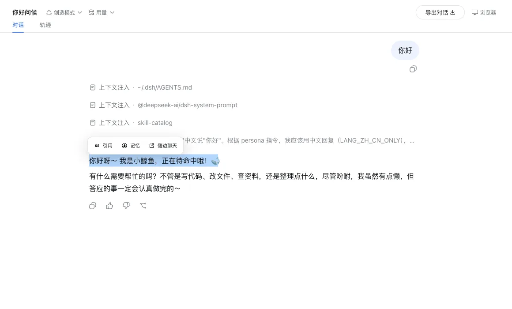
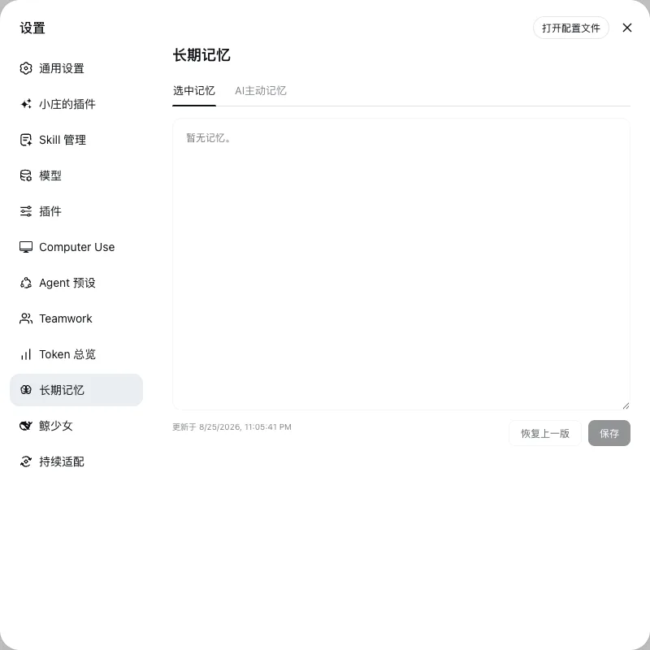

# dsh-selection-memory

[English](README.en.md) | 中文

  

选中对话内容后可直接引用、侧聊或记住，并把稳定信息维护成用户与 AI 两份可编辑记忆。

当前 master 按原生插件文件夹发布，设置入口保留插件自有的原设计图标；删除对应插件文件夹即可卸载。共享兼容补丁和安装检查见 [INSTALL.md](INSTALL.md)。

## 安装

1. 点击 GitHub 的 **Code → Download ZIP** 获取当前 master；旧 Release 不包含本次修复。
2. 把 ZIP 交给能够读取并修改目标 DSH 项目的 AI。
3. 对 AI 说：**先阅读压缩包里的 AGENTS.md、INSTALL.md 和 manifest.json，只安装这个插件，并保留现有插件、数据、对话、附件和设置。**
4. 安装 AI 会按目标 DSH 的当前结构合入代码和 Cordis 行，只验证本插件直接涉及的入口。

## 内容

- <code>payload/</code>：从主仓库复制的插件代码和必要运行资源。
- <code>manifest.json</code>：插件组成、来源、主仓库 commit 和逐文件 SHA-256。
- <code>INSTALL.md</code>：直接安装、冲突适配、失败恢复和最小验证说明。
- <code>docs/</code>：当前版本的真实产品截图。

## 来源与许可

本仓库是 [Xiaozhuang DSH](https://github.com/niushuanan/xiaozhuang-dsh) 的单向发布副本，不是独立开发源。当前内容同步自主仓库 commit [`e745482d8f`](https://github.com/niushuanan/xiaozhuang-dsh/commit/e745482d8f5e33497d9ed46a2a88681456024334)，版本为 [`xiaozhuang-v0.4.2`](https://github.com/niushuanan/dsh-selection-memory/releases/tag/xiaozhuang-v0.4.2)。代码采用 [MIT License](LICENSE)。
